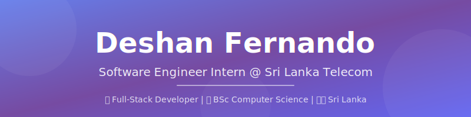

<!-- Custom Header Banner -->
<div align="center">
  
</div>

<br/>

<!-- Typing Animation (Local) -->
<div align="center">
  
</div>

<br/>

<!-- Badges Row -->
<div align="center">
  
  <a href="https://github.com/deshanFdo?tab=followers">
    
  </a>
  
  
</div>

<br/>

## 👨‍💻 About Me

```typescript
const deshan: Developer = {
    name: "Deshan Fernando",
    role: "Software Engineer Intern",
    company: "Sri Lanka Telecom",
    education: "BSc Computer Science @ Westminster",
    location: "Colombo, Sri Lanka 🇱🇰",
    
    currentlyWorking: [
        "Smart Employee System",
        "Backend Architecture",
        "System Modernization"
    ],
    
    passions: [
        "Clean Code",
        "Scalable Systems",
        "Problem Solving"
    ]
};
```

- 🏢 **Software Engineer Intern** at **Sri Lanka Telecom**
- 🎓 Pursuing **BSc (Hons) Computer Science** at **University of Westminster**
- 🏆 **Top 10 Finalist** in IEEE Xtreme Encode Competition
- 🔧 Building scalable full-stack applications with **React, Node.js & MySQL**
- 🌱 Always learning and exploring new technologies
- 💬 Ask me about **Backend Development, REST APIs & System Design**

<br clear="both"/>

---

## 🎓 Education

<table>
<tr>
<td width="80" align="center">🎓</td>
<td>
  <strong>BSc (Hons) in Computer Science</strong><br/>
  University of Westminster, UK<br/>
  <em>Jan 2023 - Present</em><br/>
  📚 Advanced Algorithms • Database Architecture • OOP
</td>
</tr>
<tr>
<td width="80" align="center">📜</td>
<td>
  <strong>Foundation Certificate in Higher Education IT</strong><br/>
  IIT, Sri Lanka<br/>
  <em>Jan 2023 - Sep 2023</em><br/>
  🏅 Grade: <strong>Distinction</strong>
</td>
</tr>
</table>

---

## 💼 Professional Experience

<div align="center">
  <h3>🏢 Sri Lanka Telecom</h3>
  <strong>Software Engineer Intern</strong><br/>
  <em>June 2025 - Present | Colombo, Sri Lanka</em>
</div>

<br/>

| Area | Contributions |
|------|---------------|
| 🔧 **Backend Architecture** | Engineered high-performance RESTful API endpoints for 'Smart Employee' platform using **Node.js** |
| 🔐 **Security & Data Isolation** | Architected strict server-client panel isolation, ensuring **100% compliance** with data privacy standards |
| ⚡ **Performance Optimization** | Revamped assessor frontend with **React**, implementing local caching & parallel data prefetching |
| 🔄 **System Modernization** | Led migration from legacy database structures to robust, normalized schemas |

---

## 🛠️ Tech Stack

<div align="center">

### 💻 Programming Languages


### 🌐 Frontend Development


### ⚙️ Backend Development


### 🗄️ Databases


### 🔧 Tools & Platforms


</div>

---

## 🚀 Featured Projects

<div align="center">

### 🏢 Smart Employee System
**Full-Stack Development** | Node.js • React • MySQL • TypeScript

</div>

> 🔐 Role-Based Access Control (RBAC) system for employee assessments with granular permission management
> 
> ⚙️ Automated workflows for training assignments and SMART status tracking

---

<div align="center">

### ⚖️ LawLinkLK
**MERN Stack** | MongoDB • Express • React • Node.js • OpenAI API • Socket.io

</div>

> 💬 Real-time legal consultation platform with secure instant messaging using **Socket.io**
> 
> 🤖 AI-powered legal assistant using **OpenAI API** for automated client intake
> 
> 🔒 Secure JWT authentication to protect sensitive client data

---

<div align="center">

### ✈️ Airline Seat Booking System
**Backend Development** | Java

</div>

> 🎫 Robust core API for managing seat reservations and passenger manifests
> 
> 📊 Focus on data consistency and reliable booking operations

---

## 🏆 Achievements & Certifications

<div align="center">

### 🎯 Achievements

| Achievement | Description |
|-------------|-------------|
| 🥇 **IEEE Xtreme Top 10** | Top 10 Finalist (Region 10) in IEEE Xtreme Encode 6-week Programming Competition 2024 |
| 💡 **Hult Prize** | Participant in Hult Prize On-Campus Competition - Innovation & Product Pitching |

### 📜 Certifications


_Cert_Prep-0089D6?style=for-the-badge&logo=microsoft-azure&logoColor=white)

</div>

---

## 📊 GitHub Stats

<div align="center">
   
  
</div>

<div align="center">
  
</div>

---

## 📈 Contribution Graph

<div align="center">
  
</div>

---

## 🤝 Let's Connect!

<div align="center">
  
  <a href="mailto:deshanfernando67@gmail.com">
    
  </a>
  <a href="https://linkedin.com/in/deshanFdo">
    
  </a>
  <a href="https://github.com/deshanFdo">
    
  </a>

</div>

<br/>

<div align="center">
  
  
</div>

---

<!-- Snake Animation eating contribution graph -->
<div align="center">
  
</div>

---

<!-- Custom Footer Banner -->
<div align="center">
  
</div>

<div align="center">
  
</div>
